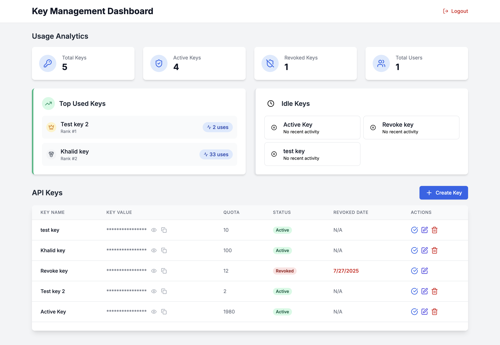
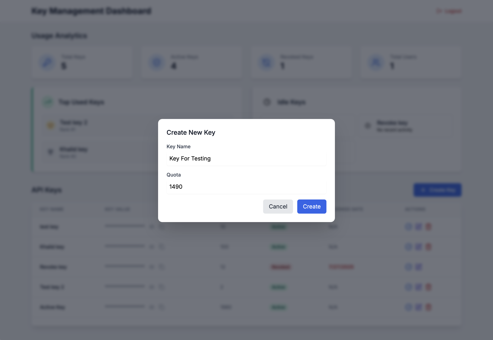
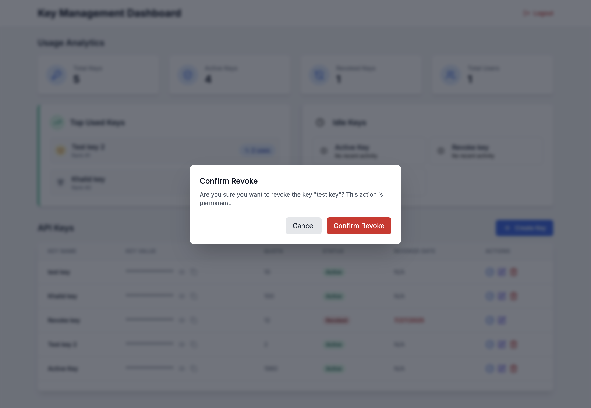
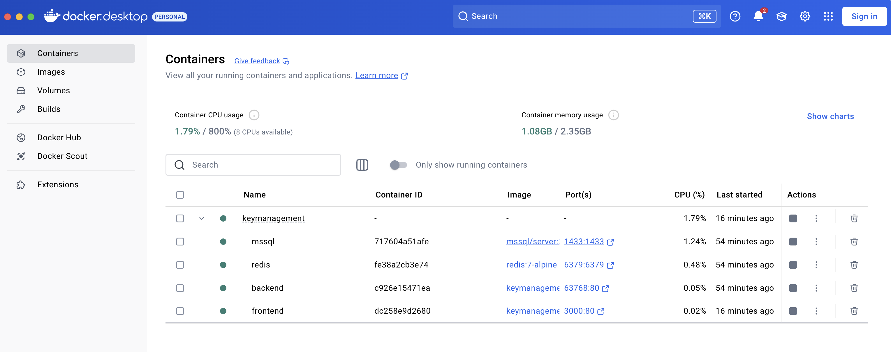

# KeyManagement Project

A full-stack key management application built with .NET 8 backend API and HTML/CSS/JS frontend, using MSSQL database and Redis cache.

## 📸 Screenshots

<div align="center">
  <table>
    <tr>
      <td align="center">
        
        <br/>
        <sub><b>Key Management Dashboard</b></sub>
      </td>
      <td align="center">
        
        <br/>
        <sub><b>Create New Key</b></sub>
      </td>
    </tr>
    <tr>
      <td align="center">
        
        <br/>
        <sub><b>Revoke Key</b></sub>
      </td>
      <td align="center">
        
        <br/>
        <sub><b>Docker Containerization</b></sub>
      </td>
    </tr>
  </table>
</div>

## Architecture

- **Backend**: .NET 8 Web API with Clean Architecture (Api, Application, Domain, Infrastructure layers)
- **Frontend**: Static HTML/CSS/JavaScript served via Python HTTP server
- **Database**: Microsoft SQL Server 2022
- **Cache**: Redis 7
- **Containerization**: Docker & Docker Compose

## Prerequisites

- [Docker](https://www.docker.com/get-started) and Docker Compose
- [.NET 8 SDK](https://dotnet.microsoft.com/download/dotnet/8.0) (for local development and migrations)

## Project Structure

```
KeyManagement/
├── Back-end/
│   ├── Api/                    # Web API layer
│   ├── Application/            # Application services
│   ├── Domain/                 # Domain entities
│   ├── Infrastructure/         # Data access & external services
│   ├── Dockerfile             # Backend container configuration
│   └── KeyManagement.sln      # Solution file
├── Front-end/
│   ├── css/                   # Stylesheets
│   ├── js/                    # JavaScript files
│   ├── *.html                 # HTML pages
│   └── Dockerfile             # Frontend container configuration
├── docker-compose.yml         # Multi-container configuration
└── README.md                  # This file
```

## Quick Start with Docker Compose

### 1. Clone and Navigate to Project
```bash
git clone https://github.com/khalid-al-shehri/KeyManagement.git
cd KeyManagement
```

### 2. Start All Services
```bash
# Build and start all containers in detached mode
docker-compose up -d
```

### 3. Access Applications
- **Frontend**: http://localhost:3000
- **Backend API**: http://localhost:63768 (HTTP) or https://localhost:63769 (HTTPS)
- **API Documentation (Swagger)**: http://localhost:63768/swagger
- **Database**: localhost:1433 (SA password: `Test123!@#`)
- **Redis**: localhost:6379

## Database Migrations

### Prerequisites for Migrations
Ensure you have .NET 8 SDK installed locally for running Entity Framework migrations.

### 1. Install EF Core Tools (if not already installed)
```bash
dotnet tool install --global dotnet-ef
```

### 2. Navigate to the API Project
```bash
cd Back-end/Api
```

### 3. Apply Migrations

#### Apply to Local Database (Development)
```bash
# Update local database with migrations
dotnet ef database update --project ../Infrastructure --startup-project .
```

## Creating Test Users for Login

After applying database migrations, you'll need to create test users to be able to login to the application. Since this is a test project, passwords are stored as plain text (not hashed/encrypted).


### Using Local SQL Client

```bash
# If you have sqlcmd installed locally
sqlcmd -S localhost,1433 -U sa -P "Test123!@#" -C
```

### Example SQL Queries to Create Test Users

Once connected to the database, run these SQL commands:

```sql
-- Switch to the KeyManagement database
USE KeyManagement;
GO

-- Create a test admin user
INSERT INTO [User] (Id, Username, FullName, Password, IsActive, CreatedAt, IsDeleted, TrackUUId)
VALUES (
    NEWID(),
    'admin',
    'System Administrator', 
    'admin123',
    1,
    GETDATE(),
    0,
    NEWID()
);
GO
```

**Important Notes:**
- Passwords are stored as plain text for testing purposes only
- In production, passwords should be properly hashed and salted

## API Documentation

Once the backend is running, visit the Swagger documentation at:
- http://localhost:63768/swagger (HTTP)
- https://localhost:63769/swagger (HTTPS)

